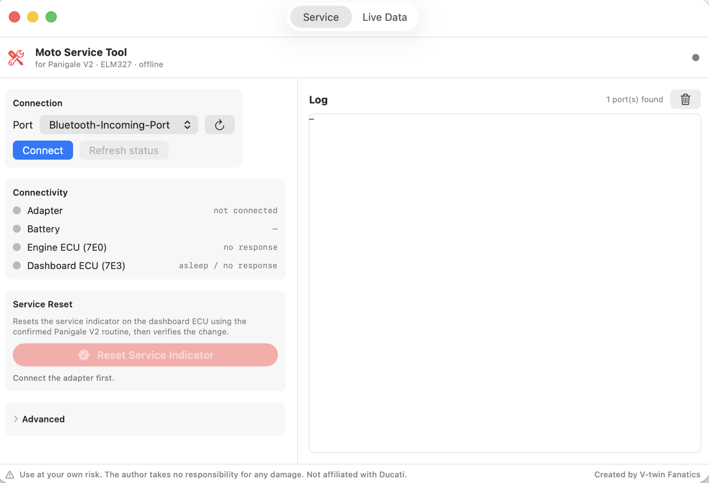

# Moto Service Tool

*Created by **V-twin Fanatics** — <fumin@ducatifanatics.com>*

A native macOS (Apple Silicon) app + CLI to **reset the service indicator** and
**read diagnostics** (live data, VIN, fault codes) on the **Ducati Panigale V2
(2020–2024)** over an **ELM327** USB adapter.

No third-party dependencies. Pure Swift talking to the ELM327 over USB serial.

```
USB serial (termios)  →  ELM327 (HS-CAN, AT commands)  →  ECU (UDS / KWP)
```

> ⚠️ **Disclaimer — use at your own risk. The author takes no responsibility
> for any damage, loss, or consequences of any kind arising from its use.**
> Provided **AS IS, with no warranty** of any kind, under the MIT License.
> It communicates with and (for the service reset) **writes to your motorcycle's
> ECU**, which could affect operation or warranty. You are solely responsible for
> use, on a vehicle **you own**.
>
> **Not affiliated with, authorized, or endorsed by** Ducati, Termignoni/UpMap,
> or the makers of MelcoDiag/JPDiag. "Ducati" and "Panigale" are trademarks of
> their owners and are used here **only** to describe vehicle compatibility
> (nominative fair use).
>
> **Scope:** diagnostics + service-indicator reset only. It does **not** perform
> ECU tuning / map flashing (those affect emissions controls), and it does
> **not** include any immobilizer-defeat / key-code functionality.

## Download

**[⬇️ Download the latest release](https://github.com/slava-fm/moto-service-tool/releases/latest)** — grab `MotoServiceTool-v1.0.zip`, unzip, drag **MotoServiceTool.app** to `/Applications`.

> First launch: **right-click → Open** (the app is ad-hoc signed, not notarized, so Gatekeeper asks once). Then plug in the ELM327 with the ignition ON and Connect.

Or build from source (below).



---

## Compatibility

| Capability | Works on |
|---|---|
| **Service reset** (one-click) | ✅ **Panigale V2 / 959** (Superquadro, 2020–2024) — *validated* |
| **Service reset** — other models | ⚠️ **Experimental** profiles (Monster/Scrambler, Hypermotard/SuperSport/Multistrada) + a **Custom** option (pick ECU header + routine). Unverified — see below. |
| **Live data, VIN, fault codes, ECU scan** | Likely many Ducatis (and other ELM327 vehicles) that support standard OBD-II / UDS — *unverified outside the V2* |

**How the model selector behaves:** the reset **self-verifies** — it checks the
routine acknowledgement (`0x71`) and whether the dashboard records actually
changed. On a non-matching model the experimental profiles simply **report "not
acknowledged" and change nothing**, so trying one is low-risk. Security-gated
models (some Monster/Scrambler) will fail because this build intentionally
includes **no immobilizer/SecurityAccess** functionality.

> ⚠️ The brand-new **2025 Panigale V2 (890 cc)** is a different platform/ECU and
> is **not** covered. Validated profiles only claim the Superquadro V2.

If you validate a routine for another model, please open an issue/PR with the
ECU header + routine id so it can be added as a confirmed profile.


## Hardware

```
Bike 6-pin Euro5 port ── [your 6→16 OBD-II cable] ── ELM327 (USB) ── Mac
```
- ⚠️ Confirm the **6-pin connector physically fits your Panigale V2** — your
  cable's listing names Guzzi/Kawasaki/Honda/Suzuki/Yamaha/Harley, not Ducati.
- Plug the ELM327 into the 16-pin side. It appears on the Mac as
  `/dev/cu.usbserial-XXXX` (USB) or `/dev/cu.<name>` (Bluetooth, after pairing).

## Features (v1.0)

Native SwiftUI app (`MotoServiceTool.app`) with two tabs + a shared log:

**Service tab**
- **Connectivity panel** — adapter, battery voltage, engine ECU (7E0) and
  dashboard ECU (7E3) reachability, with status lights.
- **Reset Service Indicator** — one click, with confirmation, that runs the
  confirmed Panigale V2 annual-service routine and **verifies** it (checks the
  `71 09` routine ack and the before/after change of dash records 91/93).
- **Advanced** — Scan ECUs, capture/replay (learn an unknown reset from
  MelcoDiag), and a manual ELM327 command box.

**Live Data tab**
- **Vehicle Info** — VIN (`22 F190`).
- **Live Data** — RPM, coolant/intake temp, throttle, engine load, speed,
  battery, polling ~1×/sec.
- **Fault Codes** — read & decode DTCs (Mode 03).

Plus a scriptable **command-line tool** (`motodiag`) using the same engine.

## Install / build

```bash
# Desktop app -> build/MotoServiceTool.app, also installs to /Applications
./scripts/make-app.sh
cp -R build/MotoServiceTool.app /Applications/        # optional
open /Applications/MotoServiceTool.app                # first launch: right-click → Open

# Command-line tool
swift build -c release
cp .build/release/motodiag /usr/local/bin/    # optional
```
Needs Xcode command-line tools (`xcode-select --install`). The app is ad-hoc
signed for local use (Gatekeeper: first run → right-click → Open).

### Reset, step by step
1. ELM327 into the bike (ignition ON), launch the app, pick the port, **Connect**.
2. Wait for **Dashboard ECU (7E3)** to show green in Connectivity.
3. **Reset Service Indicator** → confirm. The result card verifies it.
4. Cycle the ignition (OFF 15 s, ON) — indicator cleared.

### Also available (CLI)
```bash
motodiag replay --file reset-scripts/annual-service-reset.txt \
  --port /dev/cu.usbserial-XXXX --baud 38400 --yes
```
Or double-click `~/reset-ducati-service.command`.

---

## Quick start

```bash
motodiag ports        # find the adapter
motodiag test         # ignition ON: show adapter id / protocol / voltage
motodiag scan         # find which header (ECU) answers
motodiag reset        # SAFE dry-run: opens a diag session, sends nothing
```
`reset` and `replay` never transmit the actual reset unless you add `--yes`.

## The reliable way to get the exact reset (recommended)

Because the reset bytes are undocumented, capture them once from MelcoDiag and
replay them natively forever after:

1. Run the proxy (it prints a virtual serial port path):
   ```bash
   motodiag capture --file melco.log
   ```
2. In **MelcoDiag/JPDiag**, set the serial/COM port to the **virtual port path**
   the proxy printed, then perform **one** service reset as normal.
3. Stop the proxy (Ctrl-C). `melco.log` now contains the exact AT + hex sequence.
4. Replay it natively:
   ```bash
   motodiag replay --file melco.log --from-capture          # dry run, review
   motodiag replay --file melco.log --from-capture --yes    # do it
   ```

> Note: MelcoDiag and the proxy must run on the same Mac. If MelcoDiag can't see
> the virtual port, run MelcoDiag on its usual machine once with any serial
> logger, then hand-write the captured commands into a plain script and
> `replay --file script.txt --yes` (one ELM command per line, `#` for comments).

## Doing the reset directly (if you know the command)

```bash
# RoutineControl form:
motodiag reset --tx 0x7E0 --method raw --uds "31 01 FF 00" --yes
# WriteDataByIdentifier form:
motodiag reset --tx 0x7E0 --method wdbi --did 0x2F01 --data "00 00" --yes
```
If the ECU requires SecurityAccess, supply the key (seed→key algorithm is
Melco-specific):
```bash
motodiag reset --key "AA BB CC DD" --seclevel 0x01 \
  --method raw --uds "31 01 FF 00" --yes
```

---

## Commands

| Command | Purpose |
|---------|---------|
| `ports` | List USB-serial adapters |
| `test` | Connect; print adapter id, protocol, battery voltage |
| `monitor` | Read-only bus monitor (`ATMA`) |
| `scan` | Probe headers `7E0..7E7` for responding ECUs |
| `read --uds <hex>` | One UDS request, print reply |
| `send --cmd <text>` | Raw ELM327 command (`ATRV`, `1003`, …) |
| `capture --file <f>` | Proxy MelcoDiag↔ELM327, log exact bytes |
| `replay --file <f>` | Replay a capture (`--from-capture`) or script (`--yes` to send) |
| `reset [--yes]` | Service-reset sequence (dry-run without `--yes`) |

Run `motodiag help` for the full flag list. `--verbose` logs every ELM
command/response — useful when probing.

## Project layout

```
Sources/
  DucatiResetKit/     shared engine (no third-party deps)
    SerialPort.swift    POSIX termios serial I/O
    Elm327.swift        ELM327 AT setup + UDS request/response + reply parsing
    SerialProxy.swift   PTY man-in-the-middle to capture MelcoDiag traffic
  motodiag/       CLI front-end (main.swift)
  DucatiResetGUI/     SwiftUI desktop app (App / ResetViewModel / ContentView)
scripts/make-app.sh   bundles the GUI into MotoServiceTool.app
```

## Safety & legality

For resetting the service indicator on a motorcycle **you own** — a routine
operation. The tool is read-only by default and refuses to send the reset step
without an explicit `--yes`.

## Sources

- [Reset Scrambler service indicator using JPDiag/MelcoDiag (how-to)](https://www.scramblerforum.com/threads/reset-the-scrambler-service-indicator-using-jpdiag-melcodiag-software-how-to-guide.41791/)
- [How to reset service light with MelcoDiag on Panigale V2](https://ducatiforum.com/t/how-to-reset-service-light-with-melcodiag-on-panigale-v2.53509/)
- [Success at resetting V2 service lights](https://ducatiforum.com/t/success-at-resetting-v2-service-lights.52115/)
- [JPDiag — diagnostics for Ducati / MV Agusta / Guzzi / Aprilia](https://jpdiag.akress.com/)
